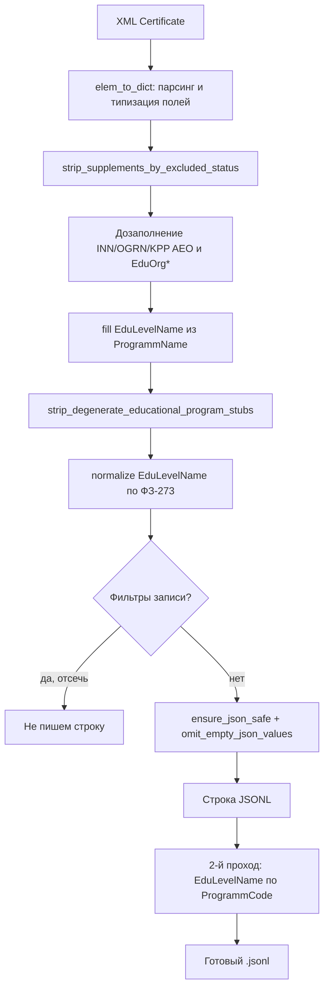

# Логика `convert.py`: XML → JSONL

Потоковый конвертер выгрузки реестра госаккредитации (ИС ГА, Рособрнадзор) в **JSON Lines**: одна строка UTF-8 = один элемент `<Certificate>`. Исходный XML не читается целиком в память (`lxml.etree.iterparse` по тегу `Certificate`).

См. также: [`AGENTS.md`](../AGENTS.md) (краткий справочник), [`docs/tools.md`](tools.md) (аудиты по готовому JSONL), [`README.md`](../README.md) (CLI-примеры).

---

## Общая схема



**Важно:** второй проход (`backfill_edulevel_name_from_programm_code_neighbors_jsonl`) выполняется **после** закрытия XML и **перезаписывает** уже записанный файл JSONL (два чтения + временный файл).

---

## Этап 1. Парсинг XML (`elem_to_dict`)

Для каждого `<Certificate>` строится дерево словарей по эталонной структуре (`specs/xml/data-20160908-structure-20160713.xml`, список тегов для предупреждений о неизвестных полях).

| Конструкция XML | В JSON |
|-----------------|--------|
| `Supplements/Supplement` | `Supplements[]` |
| `Decisions/Decision` | `Decisions[]` |
| `EducationalPrograms/EducationalProgram` | `EducationalPrograms[]` внутри supplement |
| `ActualEducationOrganization` | вложенный объект (корень или supplement) |

Если в XML нет обёртки коллекции, в дереве парсера появляются пустые массивы (`Supplements`, `Decisions`, `EducationalPrograms`); при компактной записи пустые `[]` обычно **не попадают** в JSONL.

### Очистка текста (`clean_text`)

Для всех строковых полей до типизации:

- замена нестандартных пробелов (NBSP и т.п.) на обычный пробел;
- удаление управляющих символов C0/C1 (кроме `\t`, `\n`, `\r`);
- схлопывание пробелов, `strip`;
- пустые маркеры → `null`: `""`, `-`, `—`, `н/д`, `null`, `none` и др. (`EMPTY_MARKERS`).

### Типизация скалярных полей (`normalize_scalar`)

| Группа полей | Поведение |
|--------------|-----------|
| **Булевы** (`IsFederal`, `IsAccredited`, …) | `1`/`true`/`да` → `true`, `0`/`false`/`нет` → `false`; иначе `null` + `WARNING`, счётчик `bad_booleans` |
| **Даты** (`IssueDate`, `EndDate`, `DecisionDate`) | Распознанные форматы → `YYYY-MM-DD`; иначе остаётся очищенная строка + `WARNING`, `bad_dates` |
| **ИНН/КПП/ОГРН** (корень и AEO) | После удаления пробелов и дефисов — **только цифры**; иначе `null` (ключ часто не пишется), счётчик `non_digit_ids`, детали в логе `DEBUG` |
| **`ProgrammCode`**, **`UGSCode`** | Если уже `XX.XX.XX` — без изменений; иначе шесть цифр подряд → точки (`031501` → `03.15.01`) |
| **`Qualification`** | Строка `"0"` (плейсхолдер) → `null` |
| Остальные строки | После `clean_text` как есть |

### Наименования организаций (без display v1)

Поля **`EduOrgFullName`**, **`EduOrgShortName`**, **`FullName`**, **`ShortName`** (корень и supplement) попадают в JSONL **как очищенный текст из XML** — без правил display v1 из `org_name_normalize.py` (ОПФ, кавычки, КАПС и т.д.). Типографическая нормализация и черновик словаря — **вне** конвертера: [`docs/tools.md`](tools.md) (OpenRouter, `diff_org_name_dictionaries.py`).

Идентификаторы в отчёте: `INN`, `KPP`, `OGRN`, `EduOrgINN`, `EduOrgKPP`, `EduOrgOGRN`, `IndividualEntrepreneurINN`, `IndividualEntrepreneurEGRIP`.

### Неизвестные теги

Тег, отсутствующий в эталонной схеме, парсится, но даёт **одно** `WARNING` на имя тега за прогон; имя попадает в `unknown_tags` отчёта `--report`.

### Битые записи

Исключение при обработке одного `Certificate` → строка **не пишется**, `skipped` / `broken_records`. С флагом `--strict` конвертация **прерывается**.

---

## Этап 2. Постобработка одной записи (до записи в JSONL)

Порядок вызовов в `convert_one` (для каждого сертификата, прошедшего парсер):

### 2.1. Срез приложений по статусу

**`strip_supplements_by_excluded_status`** (при `omit_inactive=True`, по умолчанию):

из `Supplements[]` **удаляются** элементы, у которых `StatusName` ∈

- «Недействующее»
- «Прекращено»
- «Лишен аккредитации»

Счётчик в отчёте: **`stripped_supplements_by_status`** (сумма удалённых элементов по всему файлу; на одном сертификате может быть >1).

Полный снимок приложений как в XML: **`--include-inactive`**.

### 2.2. Дозаполнение идентичности AEO и EduOrg (по умолчанию включено)

Отключение всего блока: **`--no-fill-aeo-coherent-inn-ogrn`**.

#### Согласованные UID

Две карточки `ActualEducationOrganization` считаются «одной организацией», если:

- совпадают `Id` (без учёта регистра UUID);
- если **оба** `HeadEduOrgId` непусты — они тоже должны совпадать.

#### `fill_aeo_inn_ogrn_from_coherent_certificate_sources`

1. **Supplement с тем же UID, что корневая AEO** — пустые `INN`/`OGRN` в supplement заполняются из корневой AEO или с корня сертификата (`EduOrgINN` / `EduOrgOGRN`).
2. **Supplement с другим `Id`** (филиал/площадка) — пустые `INN`/`OGRN` из корневой AEO, иначе из `EduOrg*` на `Certificate`.
3. **Корневая AEO** — пустые `INN`/`OGRN` из первого supplement с тем же UID, иначе из `EduOrg*` на сертификате.

Счётчики: блок **`aeo_coherent_inn_ogrn_fills`** в `--report`.

#### `fill_certificate_eduorg_inn_ogrn_from_near_aeo`

Если на корне `Certificate` нет валидных **цифровых** `EduOrgINN` / `EduOrgOGRN`:

- сначала из supplement-AEO с тем же UID;
- иначе из корневой AEO.

Счётчики: **`certificate_EduOrg_inn_ogrn_backfill_from_near_aeo`**.

#### Ручной справочник ОГРН → ИНН

Файл по умолчанию: **`specs/certificate_inn_overrides_by_ogrn.json`**.

**`apply_certificate_inn_from_manual_ogrn_map`**: при известном ОГРН записывает отсутствующие `EduOrgINN` и/или `INN` корневой AEO. Если заданы и `EduOrgOGRN`, и `ActualEducationOrganization.OGRN`, они должны **совпадать**, иначе правило не применяется.

Отключение: **`--no-certificate-inn-overrides-by-ogrn`**. Свой файл: **`--certificate-inn-overrides-by-ogrn-json`**.

Счётчики: **`certificate_INN_manual_override_by_OGRN_map`**.

#### «Пустые оболочки» supplement AEO

**`fill_degenerate_supplement_aeo_identity_from_certificate_donors`**: если у supplement-`ActualEducationOrganization` **нет** валидных цифровых `INN` и `OGRN` одновременно (часто только `RegionName`), копируются `INN` / `OGRN` / `KPP` с тех же доноров, что для филиалов.

Счётчики: **`supplement_ActualEducationOrganization_degenerate_identity_shell_fill`**.

### 2.3. Программы: `EduLevelName`

#### Подстановка из `ProgrammName`

**`fill_edulevel_name_from_programm_name_when_implied`**: при **пустом** `EduLevelName`, если `ProgrammName` совпадает с одной из школьных ступеней реестра (`PROGRAMM_NAMES_THAT_IMPLY_EQUAL_EDU_LEVEL_NAME` в коде — те же строки, что в аудите школьного контура), в `EduLevelName` пишется тот же текст.

Отключение: **`--no-fill-edulevel-from-programm-name`**.

Счётчик: **`educational_program_EduLevelName_from_ProgrammName_when_empty`**.

#### Удаление дегенеративных «заглушек»

**`strip_degenerate_educational_program_stubs`** выполняется **до** нормализации ФЗ-273.

Позиция удаляется из `Supplements[].EducationalPrograms[]`, если одновременно:

- нет валидного `ProgrammCode` (нормализованный вид `XX.YY.ZZ`, не `--` и не мусор);
- пустой `ProgrammName`;
- пустой `EduLevelName`.

Типичный случай в XML: узел только с `Id`. Сертификат в JSONL **остаётся**; соседние программы не трогаются. Если программ не осталось — ключ `EducationalPrograms` у supplement убирается.

Счётчик: **`stripped_degenerate_educational_programs`**.

**Зачем до ФЗ-273:** если маппинг позже удалит `EduLevelName` (`target_edu_level_name: null`), программа с осмысленным уровнем в реестре **не** считается заглушкой и не вырезается.

#### Нормализация по ФЗ-273

**`normalize_edu_level_names_via_fz273_map`**: для **непустого** `EduLevelName` в `EducationalPrograms[]` по файлу **`specs/edu_level_names_fz273_map.json`**:

| Ситуация | Действие |
|----------|----------|
| Строка в `entries` → целевое имя | Переименование |
| Строка в `entries` → `null` | Ключ `EduLevelName` удаляется |
| Строка совпадает с каноном, нет в `entries` | Без изменения (implicit identity) |
| Не в `entries` и не в каноне | Без изменения + счётчик `unknown_registry_level_programs` |

Отключение: **`--no-normalize-edu-level-names-fz273`**. Свой JSON: **`--edu-level-names-fz273-map-json`**.

Счётчики: **`educational_program_EduLevelName_fz273_map`**.

---

## Этап 3. Фильтры: целая строка сертификата не пишется

Проверки выполняются **после** постобработки. Первое сработавшее условие отсекает запись (цепочка `if / elif`):

| Условие | Флаг / константа | Счётчик отчёта |
|---------|------------------|----------------|
| Корневой `StatusName` ∈ «Недействующее», «Прекращено», «Лишен аккредитации» | по умолчанию `omit_inactive=True` | `omitted_inactive` |
| Корневой `RegionName` = псевдорегион «за пределами РФ» | по умолчанию `omit_outside_rf_region=True` | `omitted_outside_rf_region` |
| Нет валидного `EduOrgOGRN` (только цифры после очистки) | **`--omit-invalid-eduorg-ogrn`** (по умолчанию **выкл.**) | `omitted_invalid_eduorg_ogrn` |
| `Certificate.Id` в жёстком блоклисте | `CERTIFICATE_IDS_OMITTED_FROM_JSONL_BLOCKLIST` в коде | `omitted_certificate_personal_blocklist` |

Полный снимок по статусу/региону: **`--include-inactive`**, **`--include-outside-rf-region`**.

### Компактный JSON (по умолчанию)

Перед записью строки:

1. **`ensure_json_safe`** — удаление недопустимых для JSON управляющих символов в строках.
2. **`omit_empty_json_values`** (по умолчанию **вкл.**) — убрать ключи с `null`, пустыми строками, пустыми `{}` / `[]`; пустые объекты внутри списков тоже выбрасываются.

Полное дерево как после парсера: **`--include-null-keys`**.

В JSONL **нет** поля `_source_file` / имени XML-файла; провенанс снимка добавляйте при загрузке снаружи.

---

## Этап 4. Второй проход по JSONL (`ProgrammCode` → `EduLevelName`)

**`backfill_edulevel_name_from_programm_code_neighbors_jsonl`** (по умолчанию **вкл.**):

1. **Проход 1:** по всему файлу для каждого нормализованного `ProgrammCode` (`XX.YY.ZZ`) строится частота непустых `EduLevelName` среди программ с этим кодом.
2. Выбирается уровень с **максимальной** частотой; при равенстве — **лексикографически минимальная** строка.
3. **Проход 2:** у программ с пустым `EduLevelName` и тем же кодом подставляется выбранный уровень; файл перезаписывается атомарно через `*.neighbor_tmp`.

Отключение: **`--no-fill-edulevel-from-programm-code-neighbors`**.

Счётчик: **`educational_program_EduLevelName_neighbor_backfill_from_ProgrammCode_global_pass`**.

Глобальность: доноры могут быть на **других** сертификатах в том же файле JSONL.

---

## Отчёт `--report`

JSON со сводкой по прогону. Основные блоки в `total`:

| Ключ | Смысл |
|------|--------|
| `processed` | Записано строк JSONL |
| `skipped` | Пропущено из-за исключения при разборе |
| `omitted_inactive` | Не записаны целые сертификаты (статус на корне) |
| `omitted_outside_rf_region` | Не записаны (псевдорегион) |
| `omitted_invalid_eduorg_ogrn` | Не записаны (нет валидного EduOrgOGRN) |
| `stripped_supplements_by_status` | Удалено элементов `Supplements[]` |
| `omitted_certificate_personal_blocklist` | Блоклист по `Certificate.Id` |
| `warnings` | `bad_dates`, `bad_booleans`, `non_digit_ids`, `broken_records`, `unknown_tags` |
| `aeo_coherent_inn_ogrn_fills` | Дозаполнения INN/OGRN в AEO |
| `certificate_EduOrg_inn_ogrn_backfill_from_near_aeo` | Подъём EduOrg* на корне |
| `certificate_INN_manual_override_by_OGRN_map` | Ручной ОГРН→ИНН |
| `supplement_ActualEducationOrganization_degenerate_identity_shell_fill` | Оболочки supplement AEO |
| `educational_program_EduLevelName_from_ProgrammName_when_empty` | Школьные ступени из имени программы |
| `stripped_degenerate_educational_programs` | Вырезаны заглушки программ |
| `educational_program_EduLevelName_neighbor_backfill_from_ProgrammCode_global_pass` | 2-й проход по коду |
| `educational_program_EduLevelName_fz273_map` | Переименования / очистки ФЗ-273 |
| `elapsed_seconds` | Время прогона |

---

## Связанные артефакты и ограничения

| Артефакт | Назначение |
|----------|------------|
| `specs/xml/data-20160908-structure-20160713.xml` | Эталон тегов |
| `specs/edu_level_names_fz273_map.json` | Маппинг `EduLevelName` |
| `specs/certificate_inn_overrides_by_ogrn.json` | Ручные ОГРН→ИНН |
| `specs/json-schema/certificate-line.schema.json` | Схема одной строки JSONL |

**`Decisions[]`:** пустой `Id` документа в XML → в JSON `Id: null`; сертификат сохраняется. Импорт в SQL/DuckDB такие решения **не вставляет** (нужен PK) — см. [`docs/sql_convert.md`](sql_convert.md).

**Справочник уникальных программ** (`tools/extract_unique_educational_programs.py`) намеренно **не** включает в дедупликацию `TypeName`, `EduNormativePeriod`, статусы аккредитации программы — см. help утилиты.

---

## Типичная команда

```bash
python convert.py data/data-20260403-structure-20160713.xml \
  -o out/data-20260403-structure-20160713.jsonl \
  --report out/data-20260403-structure-20160713.report.json \
  --progress-every 10000 \
  --log-file out/convert.log
```

Полный снимок как в XML (все статусы, регион, null-ключи):

```bash
python convert.py data/file.xml -o out/full.jsonl \
  --include-inactive --include-outside-rf-region --include-null-keys
```
