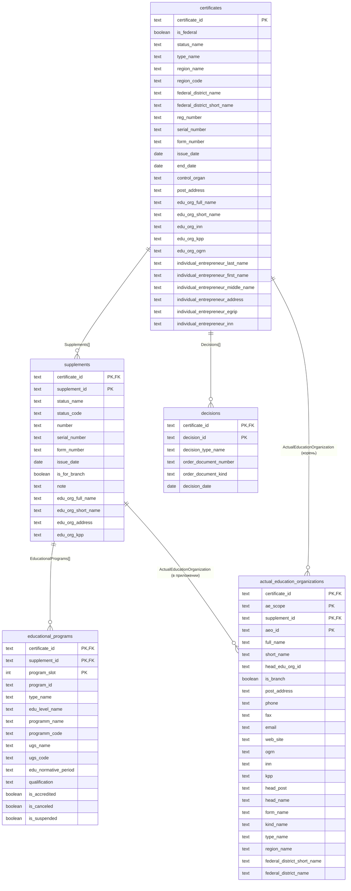

# Реляционная схема (SQL mapping)

Файл **генерируется** из [`../../specs/sql/mapping.json`](../../specs/sql/mapping.json) скриптом `tools/generate_sql_er_diagram.py` (все колонки и связи по `foreign_keys`, как в DDL/`sql_convert`). На GitHub блок **`mermaid`** отображается штатно.

```bash
python tools/generate_sql_er_diagram.py
```

## Таблицы и связи



## Заметки (политика данных, не видны на ER)

- **`decisions`**: элементы `Decisions[]` с пустым `Id` в JSONL **не вставляются**; сертификат в `certificates` остаётся.
- **`educational_programs`**: в PK входит **`program_slot`** (индекс в массиве), т.к. **`program_id`** из реестра может повторяться.
- **`actual_education_organizations`**: поле **`ae_scope`** (`certificate` | `supplement`); FK на `supplements` относится к строкам с областью приложения (см. [`sql_convert.md`](../sql_convert.md)).
