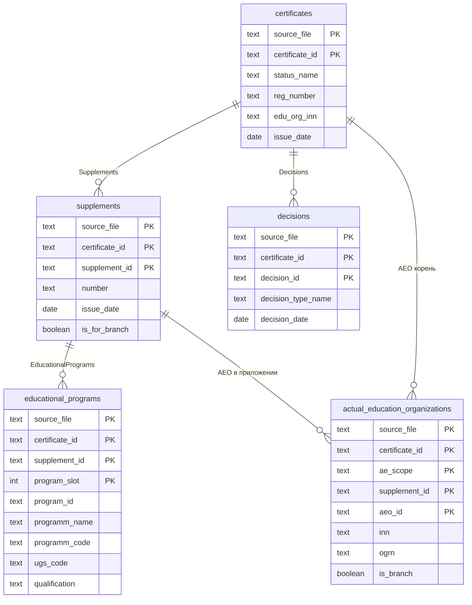

# Реляционная схема (SQL mapping)

Актуально относительно [`specs/sql/mapping.json`](../../specs/sql/mapping.json). На GitHub блоки **`mermaid`** в Markdown отображаются штатно.

## Таблицы и связи

## Заметки

- Составные первичные ключи: в диаграмме перечислены только поля, входящие в PK; полный список колонок — в `mapping.json` и в [`sql_convert.md`](../sql_convert.md).
- **`decisions`**: строки с пустым `Id` в JSON не импортируются (нет PK документа); сертификат остаётся в `certificates`.
- **`educational_programs`**: в PK входит **`program_slot`** (индекс в массиве), потому что **`program_id`** из реестра может повторяться.
- **`actual_education_organizations`**: поле **`ae_scope`** (`certificate` | `supplement`) разделяет корневую ОО и ОО внутри приложения; FK на `supplements` действует для строк с `ae_scope = supplement` (см. импортёр и `sql_convert.md`).
